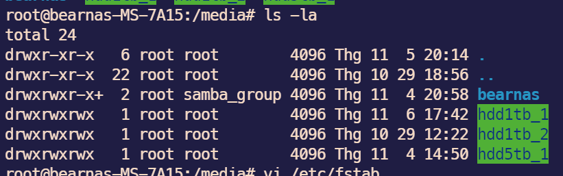

# Setup a linux nas server
## I have set up a DIY NAS for myself. I use an old PC which uses lower TDP when running for long time used. 
## this NAS is used by a Windows machine and 2 iPads (use for watching high resolution videos)

## setup for mounting disks and hosting a samba server

- check uuid of disk by command: 
    >`sudo blkid`
- Following the docker-compose.yaml file, I have 3 storages, they are mounted to /media/hdd1tb_1, /media/hdd1tb_2, and /media/hdd5tb_1, correctively.
- Firstly, they have been to be mounted below

the permissions of them will be like this

- reload fstab 
    >`sudo mount -a` or restart the computer

- install docker engine, and run at folder `samba-docker-compose` which contains *docker-compose.yaml*
    > docker compose up -d
- when service is running like below -> it is done for use
    


- setup firewall
    > sudo ufw allow 139

    >   sudo ufw allow 445

    >    sudo ufw allow 137

    >    sudo ufw allow 138

### *Use on device*
Notice that, my samba server has IP address is 192.168.1.135.
- for windows:
    

    and the result
    

- for ipad: I use VLC to connect samba server
    

Noticable things: in  yaml file, 

- `bear` is user
- `bearpasswd` is password     


## setup wake-on-lan for using
*please checking, install, enable, setup for wol firstly https://www.golinuxcloud.com/wake-on-lan-ubuntu/ and enable wake up on lan corresponding to its mainboard (for example, my mainboard is MSI, for example: https://www.youtube.com/watch?v=-E26oG_39-M*
- For example my network mac: ***30:9c:23:25:16:78***

- **For Windows with using powershell**:
    -   use script `Wake.ps1` ( I refer [him](https://gist.github.com/alimbada/4949168))
    -  copy the script `Wake.ps1` to the default location in Windows OS of the machine
        
    -  running command `./Wake.ps1 Address` for waking up the nas  ( or using `Wake_nas.ps1`  instead of `Wake.ps1` for short command)
        
- with WakeOnWAN: Please setup Port-Forward of router to the NAS, from linux -> enter the public IP of router. Can use command:
```
    wakeonlan -i <public-IP> -p <Port of Router which are routed to the port 9 NAS> <MAC Address> 
    For example: 
    waleonlan -i 1.52.98.180 -p 9 2a:4b:5c:12d:11a:12
```

- WAKE from Iphone/iPad:


- **For iPad**:
    - Use App `Wolow` for set magic packet to wake on lan
    - use `iSH`:
        - install packages
            > apk add openssh

            > apk add sshpass
        - write a script shutdown automatically: 
          > vi shutdown.sh
          - fill content:
            ```
            #!/bin/sh
            sshpass -p 'naspass' ssh -t shutdown_user@192.168.1.135 "sudo powerofF"
            ```
          > chmod +x shutdown.sh
    - For shutdown -> `./shutdown.sh`

- **Setup on NAS Server sudoer withoutpassword for using shutdown script from ipad**
    - TL;DR: Refer [this](https://www.tecmint.com/run-sudo-command-without-password-linux/)
    - Brief:
        > sudo adduser shutdown_user
        
        > sudo usermod -aG sudo shutdown_user

        > sudo visudo 

        - add the content
        ```
        shutdown_user ALL=(ALL) NOPASSWD: ALL
        ```   
        > sudo -v

        Finished !!!
