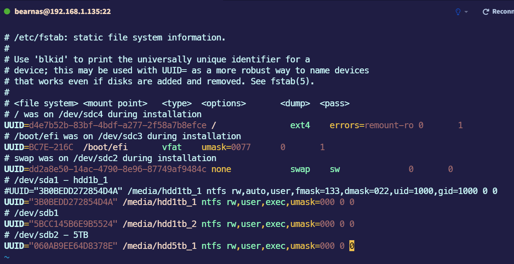

# Setup a linux nas server
## I have set up a DIY NAS for myself. I use an old PC which uses lower TDP when running for long time used. 
## this NAS is used by a Windows machine and 2 iPads (use for watching high resolution videos)

## setup for mounting disks and hosting a samba server

- check uuid of disk by command: 
    >`sudo blkid`
- Following the docker-compose.yaml file, I have 2 storages, one is mounted to /home/hdd1tb_1 and the else is mounted to /home/hdd1tb_2.

- reload fstab 
    >`sudo mount -a`

- install docker engine, and run at folder which contains *docker-compose.yaml*
    > docker compose up -d
- when service is running like below -> it is done for use
    

- setup firewall
    > sudo ufw allow 139

    >   sudo ufw allow 445

    >    sudo ufw allow 137

    >    sudo ufw allow 138

### *Use on device*
Notice that, my samba server has IP address is 192.168.1.135.
- for windows:
    

    and the result
    

- for ipad: I use VLC to connect samba server
    

Noticable things: in  yaml file, 

- `bear` is user
- `bearpasswd` is password     

## setup wake-on-lan for using
*please checking, install, enable, setup for wol firstly https://www.golinuxcloud.com/wake-on-lan-ubuntu/ and enable wake up on lan corresponding to its mainboard (for example, my mainboard is MSI, for example: https://www.youtube.com/watch?v=-E26oG_39-M*
- our network mac: ***30:9c:23:25:16:78***

- **For Windows with using powershell**:
    -   use script `Wake.ps1` ( I refer [him](https://gist.github.com/alimbada/4949168))
    -  copy the script `Wake.ps1` to the default location in Windows OS of the machine
        
    -  running command `./Wake.ps1 Address` for waking up the nas  ( or using `Wake_nas.ps1`  instead of `Wake.ps1` for short command)
        
- **For iPad**: